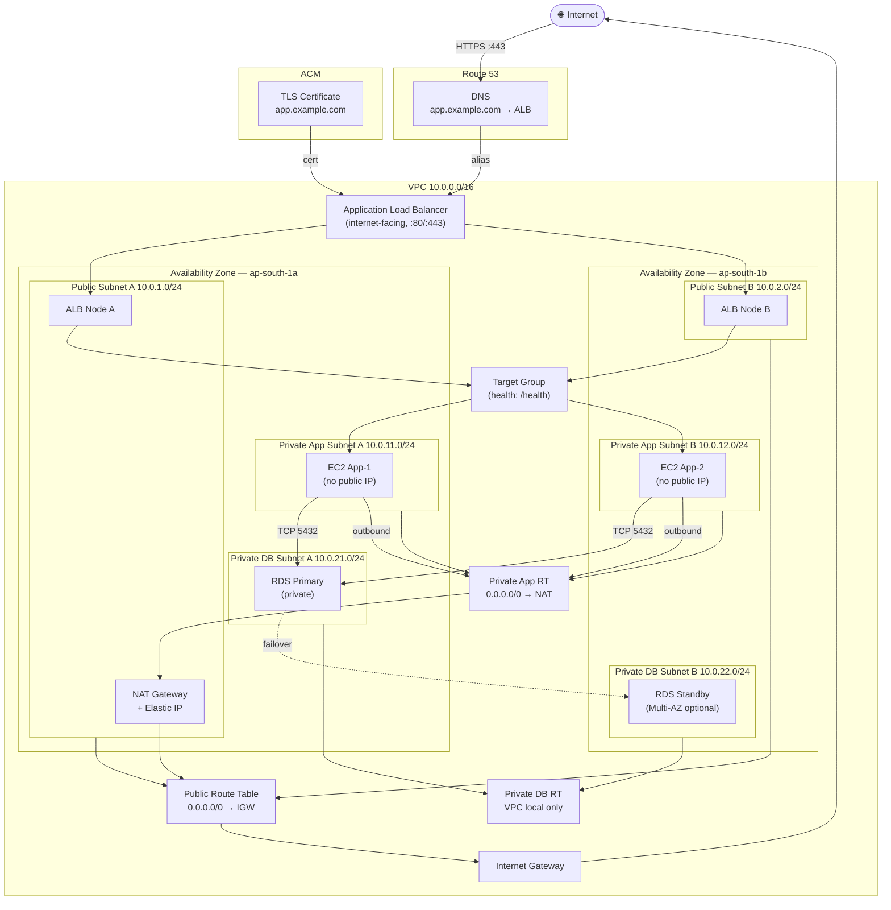
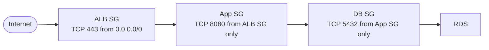

# AWS Secure Multi-Tier Network — Architecture Diagram

## Full Architecture



## Security Chain



## Traffic Flows

### Inbound (Internet → Application)

```
Client
  ↓ DNS lookup: app.example.com
  ↓
Route 53 (alias → ALB DNS)
  ↓
ALB public IP (:443)
  ↓ TLS termination
ALB Security Group (allows 443 from 0.0.0.0/0)
  ↓
ALB Listener → Target Group
  ↓ health checks pass
App Security Group (allows 8080 from ALB SG)
  ↓
EC2 App Instance (private subnet, no public IP)
  ↓
Response (same path, reversed)
```

### Private Egress (App → Internet via NAT)

```
EC2 App Instance (10.0.11.x)
  ↓
Private App Route Table
  → 0.0.0.0/0 → NAT Gateway
  ↓
NAT Gateway (in Public Subnet A, has EIP)
  ↓
Public Route Table
  → 0.0.0.0/0 → Internet Gateway
  ↓
Internet Gateway
  ↓
Internet (source IP = NAT Gateway EIP)
```

### App → RDS (VPC-local, never touches internet)

```
EC2 App Instance (10.0.11.x)
  ↓
App Security Group (egress: allows all to VPC)
  ↓
VPC Local Route (10.0.0.0/16 → local)
  ↓
DB Security Group (ingress: allows 5432 from App SG)
  ↓
RDS Instance (10.0.21.x, private subnet)
```
